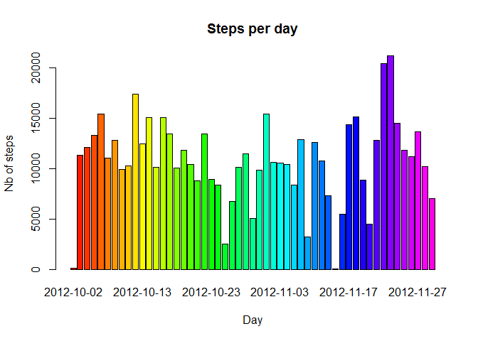
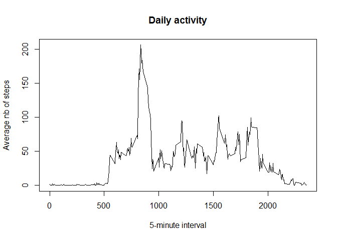
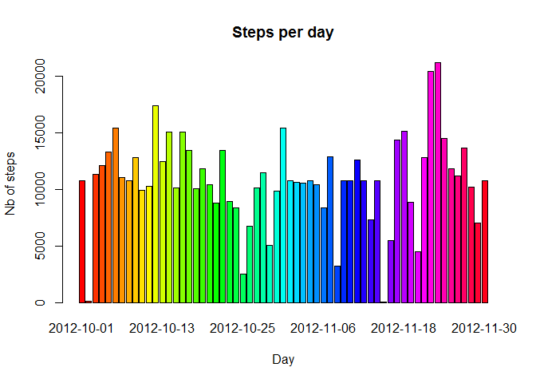
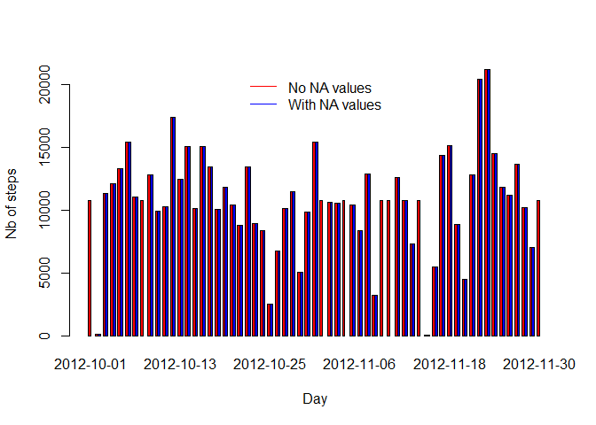

# Reproductible Research - Peer Asssesment 1
Olivier Naeem  

## Loading and preprocessing the data

### Configuration
Global configuration for the R code : 

```r
library(knitr,quietly = T)
library(xtable, quietly = T)
```

```
## Warning: package 'xtable' was built under R version 3.1.1
```

```r
opts_chunk$set(echo= TRUE, results='asis')
```

### Creating the data frame
The file *activity.zip* is uncompressed in the **./data** directory. The **./data** directory is created if needed (this should happen only the first time).
The *activity.csv* file is then put in the **data** variable (a data frame) : 


```r
# Create the data directory if not exists
if(!file.exists("./data")) {
  dir.create("./data")
}
# Uncompress the activity.csv file into the data directory 
unzip(zipfile = "./activity.zip", exdir = "./data", overwrite = T)

# Read the CSV file
data <- read.csv("./data/activity.csv")

#Displaying first values
xt <- xtable(data)
print(head(xt), type="html")
```

<!-- html table generated in R 3.1.0 by xtable 1.7-3 package -->
<!-- Sun Aug 17 21:47:31 2014 -->
<TABLE border=1>
<TR> <TH>  </TH> <TH> steps </TH> <TH> date </TH> <TH> interval </TH>  </TR>
  <TR> <TD align="right"> 1 </TD> <TD align="right">  </TD> <TD> 2012-10-01 </TD> <TD align="right">   0 </TD> </TR>
  <TR> <TD align="right"> 2 </TD> <TD align="right">  </TD> <TD> 2012-10-01 </TD> <TD align="right">   5 </TD> </TR>
  <TR> <TD align="right"> 3 </TD> <TD align="right">  </TD> <TD> 2012-10-01 </TD> <TD align="right">  10 </TD> </TR>
  <TR> <TD align="right"> 4 </TD> <TD align="right">  </TD> <TD> 2012-10-01 </TD> <TD align="right">  15 </TD> </TR>
  <TR> <TD align="right"> 5 </TD> <TD align="right">  </TD> <TD> 2012-10-01 </TD> <TD align="right">  20 </TD> </TR>
  <TR> <TD align="right"> 6 </TD> <TD align="right">  </TD> <TD> 2012-10-01 </TD> <TD align="right">  25 </TD> </TR>
   </TABLE>


### Ordering the columns
I re-order the columns to my preference (date / interval / steps) : 


```r
data <- data[, c("date", "interval", "steps")]

#Displaying first values
xt <- xtable(data)
print(head(xt), type="html")
```

<!-- html table generated in R 3.1.0 by xtable 1.7-3 package -->
<!-- Sun Aug 17 21:47:31 2014 -->
<TABLE border=1>
<TR> <TH>  </TH> <TH> date </TH> <TH> interval </TH> <TH> steps </TH>  </TR>
  <TR> <TD align="right"> 1 </TD> <TD> 2012-10-01 </TD> <TD align="right">   0 </TD> <TD align="right">  </TD> </TR>
  <TR> <TD align="right"> 2 </TD> <TD> 2012-10-01 </TD> <TD align="right">   5 </TD> <TD align="right">  </TD> </TR>
  <TR> <TD align="right"> 3 </TD> <TD> 2012-10-01 </TD> <TD align="right">  10 </TD> <TD align="right">  </TD> </TR>
  <TR> <TD align="right"> 4 </TD> <TD> 2012-10-01 </TD> <TD align="right">  15 </TD> <TD align="right">  </TD> </TR>
  <TR> <TD align="right"> 5 </TD> <TD> 2012-10-01 </TD> <TD align="right">  20 </TD> <TD align="right">  </TD> </TR>
  <TR> <TD align="right"> 6 </TD> <TD> 2012-10-01 </TD> <TD align="right">  25 </TD> <TD align="right">  </TD> </TR>
   </TABLE>

### Creating a new dataset

I aggregate all the data by date : 

```r
data_by_day <- aggregate(steps ~ date, data = data, sum, na.rm=T)

#Displaying first values
xt <- xtable(data_by_day)
print(head(xt), type="html")
```

<!-- html table generated in R 3.1.0 by xtable 1.7-3 package -->
<!-- Sun Aug 17 21:47:31 2014 -->
<TABLE border=1>
<TR> <TH>  </TH> <TH> date </TH> <TH> steps </TH>  </TR>
  <TR> <TD align="right"> 1 </TD> <TD> 2012-10-02 </TD> <TD align="right"> 126 </TD> </TR>
  <TR> <TD align="right"> 2 </TD> <TD> 2012-10-03 </TD> <TD align="right"> 11352 </TD> </TR>
  <TR> <TD align="right"> 3 </TD> <TD> 2012-10-04 </TD> <TD align="right"> 12116 </TD> </TR>
  <TR> <TD align="right"> 4 </TD> <TD> 2012-10-05 </TD> <TD align="right"> 13294 </TD> </TR>
  <TR> <TD align="right"> 5 </TD> <TD> 2012-10-06 </TD> <TD align="right"> 15420 </TD> </TR>
  <TR> <TD align="right"> 6 </TD> <TD> 2012-10-07 </TD> <TD align="right"> 11015 </TD> </TR>
   </TABLE>

## What is mean total number of steps taken per day?

### Number of steps taken per day 
The total number of steps taken per day is figured out by the following histogram : 


```r
barplot(data_by_day$steps, names.arg=data_by_day$date, main="Steps per day", xlab="Day", ylab="Nb of steps", col=rainbow(61))
```

 

### Mean and Median
The mean of total number of steps taken per day :

```r
print(mean(data_by_day$steps))
```

[1] 10766

The median of total number of steps taken per day :

```r
print(median(data_by_day$steps))
```

[1] 10765

## What is the average daily activity pattern?

### Time series
I create a new data frame containing the average number of steps taken, averaged across all days : 

```r
data_avg_steps_by_5min <- aggregate(steps ~ interval, data = data, mean, na.rm=T)
#Displaying first values
xt <- xtable(data_avg_steps_by_5min)
print(head(xt), type="html")
```

<!-- html table generated in R 3.1.0 by xtable 1.7-3 package -->
<!-- Sun Aug 17 21:47:31 2014 -->
<TABLE border=1>
<TR> <TH>  </TH> <TH> interval </TH> <TH> steps </TH>  </TR>
  <TR> <TD align="right"> 1 </TD> <TD align="right">   0 </TD> <TD align="right"> 1.72 </TD> </TR>
  <TR> <TD align="right"> 2 </TD> <TD align="right">   5 </TD> <TD align="right"> 0.34 </TD> </TR>
  <TR> <TD align="right"> 3 </TD> <TD align="right">  10 </TD> <TD align="right"> 0.13 </TD> </TR>
  <TR> <TD align="right"> 4 </TD> <TD align="right">  15 </TD> <TD align="right"> 0.15 </TD> </TR>
  <TR> <TD align="right"> 5 </TD> <TD align="right">  20 </TD> <TD align="right"> 0.08 </TD> </TR>
  <TR> <TD align="right"> 6 </TD> <TD align="right">  25 </TD> <TD align="right"> 2.09 </TD> </TR>
   </TABLE>

The time series plot figuring out the daily activity is : 

```r
plot(data_avg_steps_by_5min$steps ~ data_avg_steps_by_5min$interval, main="Daily activity", ylab = "Average nb of steps", xlab = "5-minute interval", type = "l")
```

 

### Analysing

The most active 5-min interval : 


```r
five_min_interval <- data_avg_steps_by_5min[data_avg_steps_by_5min$steps == max(data_avg_steps_by_5min$steps), c("interval")]
print(five_min_interval)
```

[1] 835

## Imputing missing values

### Calculate and report the total number of missing value
Finding the number of missing values : 


```r
nb_na_values <- colSums(is.na(data))

#Displaying number of NA values
print(nb_na_values, type="html")
```

    date interval    steps 
       0        0     2304 

### Devise a strategy for filling in all of the missing values in the dataset

I propose to replace the NA values with the mean values applying to this this specific  interval.

### Create a new dataset that is equal to the original dataset but with the missing data filled in.


```r
# Calculate the mean for each 5-min interval
mean_by_interval <- aggregate(steps ~ interval, data = data, mean, na.rm=T)

data_no_na_values <- data
# Number of NA values
sum(is.na(data_no_na_values$steps))
```

[1] 2304

```r
for (i in 1:length(data$steps) ) {
  interval <- data$interval[i]
  if (is.na(data$steps[i])) 
      data_no_na_values$steps[i] <- mean_by_interval$steps[mean_by_interval$interval == interval]
}


# Remaining NA values : should be 0 !
sum(is.na(data_no_na_values$steps))
```

[1] 0

```r
#Displaying first values
xt <- xtable(data_no_na_values)
print(head(xt), type="html")
```

<!-- html table generated in R 3.1.0 by xtable 1.7-3 package -->
<!-- Sun Aug 17 21:47:33 2014 -->
<TABLE border=1>
<TR> <TH>  </TH> <TH> date </TH> <TH> interval </TH> <TH> steps </TH>  </TR>
  <TR> <TD align="right"> 1 </TD> <TD> 2012-10-01 </TD> <TD align="right">   0 </TD> <TD align="right"> 1.72 </TD> </TR>
  <TR> <TD align="right"> 2 </TD> <TD> 2012-10-01 </TD> <TD align="right">   5 </TD> <TD align="right"> 0.34 </TD> </TR>
  <TR> <TD align="right"> 3 </TD> <TD> 2012-10-01 </TD> <TD align="right">  10 </TD> <TD align="right"> 0.13 </TD> </TR>
  <TR> <TD align="right"> 4 </TD> <TD> 2012-10-01 </TD> <TD align="right">  15 </TD> <TD align="right"> 0.15 </TD> </TR>
  <TR> <TD align="right"> 5 </TD> <TD> 2012-10-01 </TD> <TD align="right">  20 </TD> <TD align="right"> 0.08 </TD> </TR>
  <TR> <TD align="right"> 6 </TD> <TD> 2012-10-01 </TD> <TD align="right">  25 </TD> <TD align="right"> 2.09 </TD> </TR>
   </TABLE>

### Make a histogram of the total number of steps taken each day


```r
data_by_day_no_na <- aggregate(steps ~ date, data = data_no_na_values, sum, na.rm=T)

barplot(data_by_day_no_na$steps, names.arg=data_by_day_no_na$date, main="Steps per day", xlab="Day", ylab="Nb of steps", col=rainbow(61))
```

 

### Mean and Median
The mean of total number of steps taken per day (with no missing values) :

```r
print(mean(data_by_day_no_na$steps))
```

[1] 10766

The median of total number of steps taken per day (with no missing values) :

```r
print(median(data_by_day_no_na$steps))
```

[1] 10766
Compare histogram :


```r
data_by_day_no_na <- aggregate(steps ~ date, data = data_no_na_values, sum, na.rm=T)

#barplot(data_by_day_no_na$steps, names.arg=data_by_day_no_na$date, main="Steps per day", xlab="Day", ylab="Nb of steps", col=rainbow(61))
d <- merge(data_by_day_no_na, data_by_day, by = "date", all=T)
d <- t(data.frame(d$steps.x, d$steps.y))

barplot(d, names.arg=data_by_day_no_na$date, beside=TRUE, xlab="Day", ylab="Nb of steps", col=c("red", "blue"))
legend(x = "top",legend = c("No NA values", "With NA values"), bty = "n",col=c("red", "blue"), lty=1 )
```

 

## Are there differences in activity patterns between weekdays and weekends?
