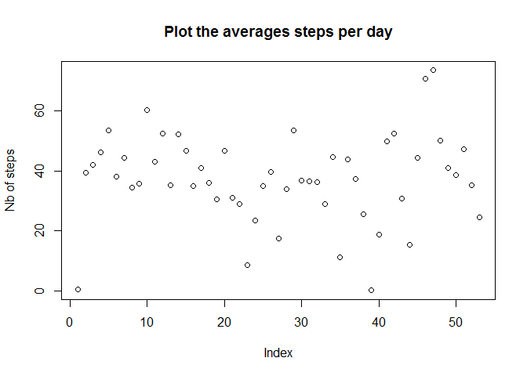

# Reproductible Research - Peer Asssesment 1
Olivier Naeem  
Sunday, July 20, 2014  

## Loading and preprocessing the data

### Configuration
Global configuration for the R code : 

```r
library(knitr)
library(xtable)
```

```
## Warning: package 'xtable' was built under R version 3.1.1
```

```r
opts_chunk$set(echo= TRUE, results='asis')
```

### Creating the data frame
The file *activity.zip* is uncompressed in the **./data** directory. The **./data** directory is created if needed (this should happen only the first time).
The *activity.csv* file is then put in the **data** variable (a data frame) : 


```r
# Create the data directory if not exists
if(!file.exists("./data")) {
  dir.create("./data")
}
# Uncompress the activity.csv file into the data directory 
unzip(zipfile = "./activity.zip", exdir = "./data", overwrite = T)

# Read the CSV file
data <- read.csv("./data/activity.csv")

#Displaying first values
xt <- xtable(data)
print(head(xt), type="html")
```

<!-- html table generated in R 3.1.0 by xtable 1.7-3 package -->
<!-- Mon Jul 21 01:10:12 2014 -->
<TABLE border=1>
<TR> <TH>  </TH> <TH> steps </TH> <TH> date </TH> <TH> interval </TH>  </TR>
  <TR> <TD align="right"> 1 </TD> <TD align="right">  </TD> <TD> 2012-10-01 </TD> <TD align="right">   0 </TD> </TR>
  <TR> <TD align="right"> 2 </TD> <TD align="right">  </TD> <TD> 2012-10-01 </TD> <TD align="right">   5 </TD> </TR>
  <TR> <TD align="right"> 3 </TD> <TD align="right">  </TD> <TD> 2012-10-01 </TD> <TD align="right">  10 </TD> </TR>
  <TR> <TD align="right"> 4 </TD> <TD align="right">  </TD> <TD> 2012-10-01 </TD> <TD align="right">  15 </TD> </TR>
  <TR> <TD align="right"> 5 </TD> <TD align="right">  </TD> <TD> 2012-10-01 </TD> <TD align="right">  20 </TD> </TR>
  <TR> <TD align="right"> 6 </TD> <TD align="right">  </TD> <TD> 2012-10-01 </TD> <TD align="right">  25 </TD> </TR>
   </TABLE>


### Ordering the columns
I re-order the columns to my preference (date / interval / steps) : 


```r
data <- data[, c("date", "interval", "steps")]

#Displaying first values
xt <- xtable(data)
print(head(xt), type="html")
```

<!-- html table generated in R 3.1.0 by xtable 1.7-3 package -->
<!-- Mon Jul 21 01:10:12 2014 -->
<TABLE border=1>
<TR> <TH>  </TH> <TH> date </TH> <TH> interval </TH> <TH> steps </TH>  </TR>
  <TR> <TD align="right"> 1 </TD> <TD> 2012-10-01 </TD> <TD align="right">   0 </TD> <TD align="right">  </TD> </TR>
  <TR> <TD align="right"> 2 </TD> <TD> 2012-10-01 </TD> <TD align="right">   5 </TD> <TD align="right">  </TD> </TR>
  <TR> <TD align="right"> 3 </TD> <TD> 2012-10-01 </TD> <TD align="right">  10 </TD> <TD align="right">  </TD> </TR>
  <TR> <TD align="right"> 4 </TD> <TD> 2012-10-01 </TD> <TD align="right">  15 </TD> <TD align="right">  </TD> </TR>
  <TR> <TD align="right"> 5 </TD> <TD> 2012-10-01 </TD> <TD align="right">  20 </TD> <TD align="right">  </TD> </TR>
  <TR> <TD align="right"> 6 </TD> <TD> 2012-10-01 </TD> <TD align="right">  25 </TD> <TD align="right">  </TD> </TR>
   </TABLE>

### Creating a new dataset

I aggregate all the data by date : 

```r
data_by_day <- aggregate(steps ~ date, data = data, sum, na.rm=T)

#Displaying first values
xt <- xtable(data_by_day)
print(head(xt), type="html")
```

<!-- html table generated in R 3.1.0 by xtable 1.7-3 package -->
<!-- Mon Jul 21 01:10:13 2014 -->
<TABLE border=1>
<TR> <TH>  </TH> <TH> date </TH> <TH> steps </TH>  </TR>
  <TR> <TD align="right"> 1 </TD> <TD> 2012-10-02 </TD> <TD align="right"> 126 </TD> </TR>
  <TR> <TD align="right"> 2 </TD> <TD> 2012-10-03 </TD> <TD align="right"> 11352 </TD> </TR>
  <TR> <TD align="right"> 3 </TD> <TD> 2012-10-04 </TD> <TD align="right"> 12116 </TD> </TR>
  <TR> <TD align="right"> 4 </TD> <TD> 2012-10-05 </TD> <TD align="right"> 13294 </TD> </TR>
  <TR> <TD align="right"> 5 </TD> <TD> 2012-10-06 </TD> <TD align="right"> 15420 </TD> </TR>
  <TR> <TD align="right"> 6 </TD> <TD> 2012-10-07 </TD> <TD align="right"> 11015 </TD> </TR>
   </TABLE>

## What is mean total number of steps taken per day?

### Number of steps taken per day 
The total number of steps taken per day is figured out by the following histogram : 


```r
barplot(data_by_day$steps, names.arg=data_by_day$date, main="Steps per day", xlab="Day", ylab="Nb of steps", col=rainbow(61))
```

 

### Mean and Median
I calculate now the mean and the median of the dataset : 


```r
mean_by_day <- aggregate(steps ~ date, data = data, mean, na.rm=T)
median_by_day <- aggregate(steps ~ date, data = data, median, na.rm=T)
data_mean_median <- cbind(mean_by_day, median=median_by_day$steps)

#Displaying mean and median
xt <- xtable(data_mean_median)
print(xt, type="html")
```

<!-- html table generated in R 3.1.0 by xtable 1.7-3 package -->
<!-- Mon Jul 21 01:10:13 2014 -->
<TABLE border=1>
<TR> <TH>  </TH> <TH> date </TH> <TH> steps </TH> <TH> median </TH>  </TR>
  <TR> <TD align="right"> 1 </TD> <TD> 2012-10-02 </TD> <TD align="right"> 0.44 </TD> <TD align="right"> 0.00 </TD> </TR>
  <TR> <TD align="right"> 2 </TD> <TD> 2012-10-03 </TD> <TD align="right"> 39.42 </TD> <TD align="right"> 0.00 </TD> </TR>
  <TR> <TD align="right"> 3 </TD> <TD> 2012-10-04 </TD> <TD align="right"> 42.07 </TD> <TD align="right"> 0.00 </TD> </TR>
  <TR> <TD align="right"> 4 </TD> <TD> 2012-10-05 </TD> <TD align="right"> 46.16 </TD> <TD align="right"> 0.00 </TD> </TR>
  <TR> <TD align="right"> 5 </TD> <TD> 2012-10-06 </TD> <TD align="right"> 53.54 </TD> <TD align="right"> 0.00 </TD> </TR>
  <TR> <TD align="right"> 6 </TD> <TD> 2012-10-07 </TD> <TD align="right"> 38.25 </TD> <TD align="right"> 0.00 </TD> </TR>
  <TR> <TD align="right"> 7 </TD> <TD> 2012-10-09 </TD> <TD align="right"> 44.48 </TD> <TD align="right"> 0.00 </TD> </TR>
  <TR> <TD align="right"> 8 </TD> <TD> 2012-10-10 </TD> <TD align="right"> 34.38 </TD> <TD align="right"> 0.00 </TD> </TR>
  <TR> <TD align="right"> 9 </TD> <TD> 2012-10-11 </TD> <TD align="right"> 35.78 </TD> <TD align="right"> 0.00 </TD> </TR>
  <TR> <TD align="right"> 10 </TD> <TD> 2012-10-12 </TD> <TD align="right"> 60.35 </TD> <TD align="right"> 0.00 </TD> </TR>
  <TR> <TD align="right"> 11 </TD> <TD> 2012-10-13 </TD> <TD align="right"> 43.15 </TD> <TD align="right"> 0.00 </TD> </TR>
  <TR> <TD align="right"> 12 </TD> <TD> 2012-10-14 </TD> <TD align="right"> 52.42 </TD> <TD align="right"> 0.00 </TD> </TR>
  <TR> <TD align="right"> 13 </TD> <TD> 2012-10-15 </TD> <TD align="right"> 35.20 </TD> <TD align="right"> 0.00 </TD> </TR>
  <TR> <TD align="right"> 14 </TD> <TD> 2012-10-16 </TD> <TD align="right"> 52.38 </TD> <TD align="right"> 0.00 </TD> </TR>
  <TR> <TD align="right"> 15 </TD> <TD> 2012-10-17 </TD> <TD align="right"> 46.71 </TD> <TD align="right"> 0.00 </TD> </TR>
  <TR> <TD align="right"> 16 </TD> <TD> 2012-10-18 </TD> <TD align="right"> 34.92 </TD> <TD align="right"> 0.00 </TD> </TR>
  <TR> <TD align="right"> 17 </TD> <TD> 2012-10-19 </TD> <TD align="right"> 41.07 </TD> <TD align="right"> 0.00 </TD> </TR>
  <TR> <TD align="right"> 18 </TD> <TD> 2012-10-20 </TD> <TD align="right"> 36.09 </TD> <TD align="right"> 0.00 </TD> </TR>
  <TR> <TD align="right"> 19 </TD> <TD> 2012-10-21 </TD> <TD align="right"> 30.63 </TD> <TD align="right"> 0.00 </TD> </TR>
  <TR> <TD align="right"> 20 </TD> <TD> 2012-10-22 </TD> <TD align="right"> 46.74 </TD> <TD align="right"> 0.00 </TD> </TR>
  <TR> <TD align="right"> 21 </TD> <TD> 2012-10-23 </TD> <TD align="right"> 30.97 </TD> <TD align="right"> 0.00 </TD> </TR>
  <TR> <TD align="right"> 22 </TD> <TD> 2012-10-24 </TD> <TD align="right"> 29.01 </TD> <TD align="right"> 0.00 </TD> </TR>
  <TR> <TD align="right"> 23 </TD> <TD> 2012-10-25 </TD> <TD align="right"> 8.65 </TD> <TD align="right"> 0.00 </TD> </TR>
  <TR> <TD align="right"> 24 </TD> <TD> 2012-10-26 </TD> <TD align="right"> 23.53 </TD> <TD align="right"> 0.00 </TD> </TR>
  <TR> <TD align="right"> 25 </TD> <TD> 2012-10-27 </TD> <TD align="right"> 35.14 </TD> <TD align="right"> 0.00 </TD> </TR>
  <TR> <TD align="right"> 26 </TD> <TD> 2012-10-28 </TD> <TD align="right"> 39.78 </TD> <TD align="right"> 0.00 </TD> </TR>
  <TR> <TD align="right"> 27 </TD> <TD> 2012-10-29 </TD> <TD align="right"> 17.42 </TD> <TD align="right"> 0.00 </TD> </TR>
  <TR> <TD align="right"> 28 </TD> <TD> 2012-10-30 </TD> <TD align="right"> 34.09 </TD> <TD align="right"> 0.00 </TD> </TR>
  <TR> <TD align="right"> 29 </TD> <TD> 2012-10-31 </TD> <TD align="right"> 53.52 </TD> <TD align="right"> 0.00 </TD> </TR>
  <TR> <TD align="right"> 30 </TD> <TD> 2012-11-02 </TD> <TD align="right"> 36.81 </TD> <TD align="right"> 0.00 </TD> </TR>
  <TR> <TD align="right"> 31 </TD> <TD> 2012-11-03 </TD> <TD align="right"> 36.70 </TD> <TD align="right"> 0.00 </TD> </TR>
  <TR> <TD align="right"> 32 </TD> <TD> 2012-11-05 </TD> <TD align="right"> 36.25 </TD> <TD align="right"> 0.00 </TD> </TR>
  <TR> <TD align="right"> 33 </TD> <TD> 2012-11-06 </TD> <TD align="right"> 28.94 </TD> <TD align="right"> 0.00 </TD> </TR>
  <TR> <TD align="right"> 34 </TD> <TD> 2012-11-07 </TD> <TD align="right"> 44.73 </TD> <TD align="right"> 0.00 </TD> </TR>
  <TR> <TD align="right"> 35 </TD> <TD> 2012-11-08 </TD> <TD align="right"> 11.18 </TD> <TD align="right"> 0.00 </TD> </TR>
  <TR> <TD align="right"> 36 </TD> <TD> 2012-11-11 </TD> <TD align="right"> 43.78 </TD> <TD align="right"> 0.00 </TD> </TR>
  <TR> <TD align="right"> 37 </TD> <TD> 2012-11-12 </TD> <TD align="right"> 37.38 </TD> <TD align="right"> 0.00 </TD> </TR>
  <TR> <TD align="right"> 38 </TD> <TD> 2012-11-13 </TD> <TD align="right"> 25.47 </TD> <TD align="right"> 0.00 </TD> </TR>
  <TR> <TD align="right"> 39 </TD> <TD> 2012-11-15 </TD> <TD align="right"> 0.14 </TD> <TD align="right"> 0.00 </TD> </TR>
  <TR> <TD align="right"> 40 </TD> <TD> 2012-11-16 </TD> <TD align="right"> 18.89 </TD> <TD align="right"> 0.00 </TD> </TR>
  <TR> <TD align="right"> 41 </TD> <TD> 2012-11-17 </TD> <TD align="right"> 49.79 </TD> <TD align="right"> 0.00 </TD> </TR>
  <TR> <TD align="right"> 42 </TD> <TD> 2012-11-18 </TD> <TD align="right"> 52.47 </TD> <TD align="right"> 0.00 </TD> </TR>
  <TR> <TD align="right"> 43 </TD> <TD> 2012-11-19 </TD> <TD align="right"> 30.70 </TD> <TD align="right"> 0.00 </TD> </TR>
  <TR> <TD align="right"> 44 </TD> <TD> 2012-11-20 </TD> <TD align="right"> 15.53 </TD> <TD align="right"> 0.00 </TD> </TR>
  <TR> <TD align="right"> 45 </TD> <TD> 2012-11-21 </TD> <TD align="right"> 44.40 </TD> <TD align="right"> 0.00 </TD> </TR>
  <TR> <TD align="right"> 46 </TD> <TD> 2012-11-22 </TD> <TD align="right"> 70.93 </TD> <TD align="right"> 0.00 </TD> </TR>
  <TR> <TD align="right"> 47 </TD> <TD> 2012-11-23 </TD> <TD align="right"> 73.59 </TD> <TD align="right"> 0.00 </TD> </TR>
  <TR> <TD align="right"> 48 </TD> <TD> 2012-11-24 </TD> <TD align="right"> 50.27 </TD> <TD align="right"> 0.00 </TD> </TR>
  <TR> <TD align="right"> 49 </TD> <TD> 2012-11-25 </TD> <TD align="right"> 41.09 </TD> <TD align="right"> 0.00 </TD> </TR>
  <TR> <TD align="right"> 50 </TD> <TD> 2012-11-26 </TD> <TD align="right"> 38.76 </TD> <TD align="right"> 0.00 </TD> </TR>
  <TR> <TD align="right"> 51 </TD> <TD> 2012-11-27 </TD> <TD align="right"> 47.38 </TD> <TD align="right"> 0.00 </TD> </TR>
  <TR> <TD align="right"> 52 </TD> <TD> 2012-11-28 </TD> <TD align="right"> 35.36 </TD> <TD align="right"> 0.00 </TD> </TR>
  <TR> <TD align="right"> 53 </TD> <TD> 2012-11-29 </TD> <TD align="right"> 24.47 </TD> <TD align="right"> 0.00 </TD> </TR>
   </TABLE>


```r
plot(mean_by_day$steps, main="Plot the averages steps per day", ylab="Nb of steps")
```

 

## What is the average daily activity pattern?

### Time series
I create a new data frame containing the average number of steps taken, averaged across all days : 

```r
data_avg_steps_by_5min <- aggregate(steps ~ interval, data = data, mean, na.rm=T)
#Displaying first values
xt <- xtable(data_avg_steps_by_5min)
print(head(xt), type="html")
```

<!-- html table generated in R 3.1.0 by xtable 1.7-3 package -->
<!-- Mon Jul 21 01:10:13 2014 -->
<TABLE border=1>
<TR> <TH>  </TH> <TH> interval </TH> <TH> steps </TH>  </TR>
  <TR> <TD align="right"> 1 </TD> <TD align="right">   0 </TD> <TD align="right"> 1.72 </TD> </TR>
  <TR> <TD align="right"> 2 </TD> <TD align="right">   5 </TD> <TD align="right"> 0.34 </TD> </TR>
  <TR> <TD align="right"> 3 </TD> <TD align="right">  10 </TD> <TD align="right"> 0.13 </TD> </TR>
  <TR> <TD align="right"> 4 </TD> <TD align="right">  15 </TD> <TD align="right"> 0.15 </TD> </TR>
  <TR> <TD align="right"> 5 </TD> <TD align="right">  20 </TD> <TD align="right"> 0.08 </TD> </TR>
  <TR> <TD align="right"> 6 </TD> <TD align="right">  25 </TD> <TD align="right"> 2.09 </TD> </TR>
   </TABLE>

The time series plot figuring out the daily activity is : 

```r
plot(data_avg_steps_by_5min$steps ~ data_avg_steps_by_5min$interval, main="Daily activity", ylab = "Average nb of steps", xlab = "5-minute interval", type = "l")
```

 

### Analysing

The most active 5-min interval : 


```r
five_min_interval <- data_avg_steps_by_5min[data_avg_steps_by_5min$steps == max(data_avg_steps_by_5min$steps), c("interval")]
print(five_min_interval)
```

[1] 835

## Imputing missing values

### Calculate and report the total number of missing value
Finding the number of missing values : 


```r
nb_na_values <- colSums(is.na(data))

#Displaying number of NA values
print(nb_na_values, type="html")
```

    date interval    steps 
       0        0     2304 

### Devise a strategy for filling in all of the missing values in the dataset

I propose to replace the NA values with the mean values applying to this this specific  intervall.

### Create a new dataset that is equal to the original dataset but with the missing data filled in.


```r
# Calculate the mean for each 5-min interval
mean_by_interval <- aggregate(steps ~ interval, data = data, mean, na.rm=T)

data_no_na_values <- data
# Number of NA values
sum(is.na(data_no_na_values$steps))
```

[1] 2304

```r
for (i in 1:length(data$steps) ) {
  interval <- data$interval[i]
  if (is.na(data$steps[i])) 
      data_no_na_values$steps[i] <- mean_by_interval$steps[mean_by_interval$interval == interval]
}


# Remaining NA values : should be 0 !
sum(is.na(data_no_na_values$steps))
```

[1] 0

```r
#Displaying first values
xt <- xtable(data_no_na_values)
print(head(xt), type="html")
```

<!-- html table generated in R 3.1.0 by xtable 1.7-3 package -->
<!-- Mon Jul 21 01:10:15 2014 -->
<TABLE border=1>
<TR> <TH>  </TH> <TH> date </TH> <TH> interval </TH> <TH> steps </TH>  </TR>
  <TR> <TD align="right"> 1 </TD> <TD> 2012-10-01 </TD> <TD align="right">   0 </TD> <TD align="right"> 1.72 </TD> </TR>
  <TR> <TD align="right"> 2 </TD> <TD> 2012-10-01 </TD> <TD align="right">   5 </TD> <TD align="right"> 0.34 </TD> </TR>
  <TR> <TD align="right"> 3 </TD> <TD> 2012-10-01 </TD> <TD align="right">  10 </TD> <TD align="right"> 0.13 </TD> </TR>
  <TR> <TD align="right"> 4 </TD> <TD> 2012-10-01 </TD> <TD align="right">  15 </TD> <TD align="right"> 0.15 </TD> </TR>
  <TR> <TD align="right"> 5 </TD> <TD> 2012-10-01 </TD> <TD align="right">  20 </TD> <TD align="right"> 0.08 </TD> </TR>
  <TR> <TD align="right"> 6 </TD> <TD> 2012-10-01 </TD> <TD align="right">  25 </TD> <TD align="right"> 2.09 </TD> </TR>
   </TABLE>

### Make a histogram of the total number of steps taken each day


```r
data_by_day_no_na <- aggregate(steps ~ date, data = data_no_na_values, sum, na.rm=T)

barplot(data_by_day_no_na$steps, names.arg=data_by_day_no_na$date, main="Steps per day", xlab="Day", ylab="Nb of steps", col=rainbow(61))
```

 

## Are there differences in activity patterns between weekdays and weekends?
